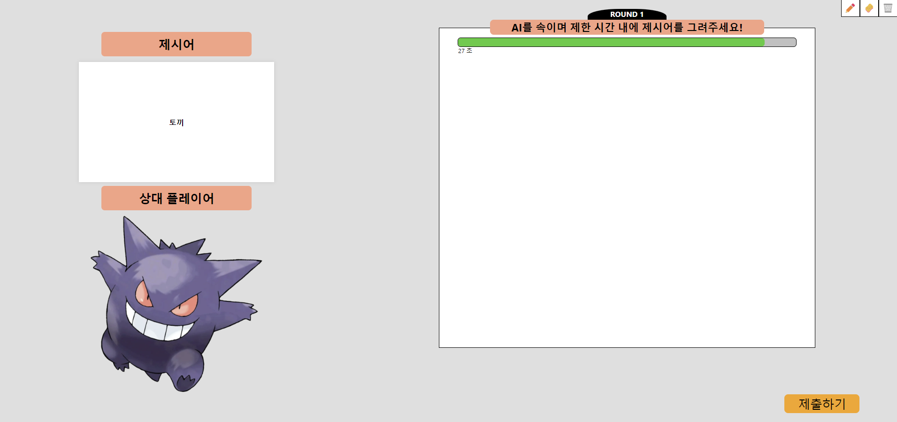
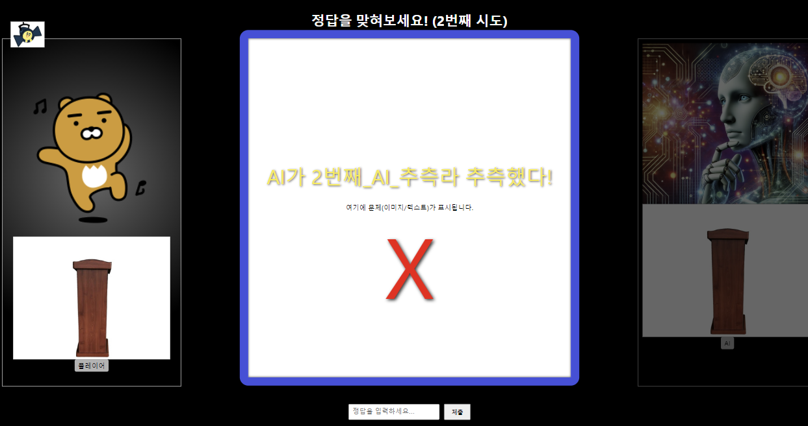

# 1. GamePage 페이지

역할:
게임의 전체 흐름과 라운드 진행을 관리합니다.

## 핵심 기능:

- 타이머 관리:
  GAME_DURATION(30초)로 각 라운드마다 시간을 설정합니다.(그리는데 주어지는 제한시간임)
  useEffect를 사용해 매 초마다 남은 시간을 1초씩 줄입니다.
  시간이 0이 되면 현재 라운드의 동작(예: 그림 제출 또는 추측)이 자동으로 처리됩니다.
- 라운드 관리:
  총 3라운드(실제 라운드 진행은 6단계, 홀수는 그림 그리기, 짝수는 다른 플레이어의 그림을 보고 추측하기)로 구성됩니다.
  roundNum 상태로 현재 라운드를 관리하며, 각 라운드마다 시간 초기화를 수행합니다.
  모든 라운드가 끝나면 "게임 종료" 화면을 표시합니다.
- 페이지 분기:
  홀수 단계(roundNum % 2 === 1)에서는 그림 그리기 페이지(DrawingCanvas)를 보여주고,
  짝수 단계에서는 정답 추측 페이지(GuessStage)를 보여줍니다.

- 게임 정보 전달:
  게임에 필요한 정보(제시어, 협력 플레이어 정보 등)를 gameInfo 객체에 저장하고, 이를 각 컴포넌트에 props로 전달합니다.

# 2. DrawingCanvas 컴포넌트

역할:
그림 그리기 단계를 제공하며, 사용자가 자유롭게 그림을 그리고 제출할 수 있도록 합니다.

## 핵심 기능:

- 그림 그리기:
  react-konva 라이브러리를 사용해 캔버스 위에 선(Line) 형태로 그림을 그릴 수 있습니다.
  사용자가 마우스 클릭 및 이동 이벤트를 통해 선을 그리고, lines 상태에 그려진 선들의 좌표 정보를 저장합니다.
  도구(tool)를 선택할 수 있도록 하여 펜 또는 지우개 기능을 제공합니다.

- 캔버스 초기화 및 제출:
  사용자가 그림을 제출하면, 캔버스의 데이터를 이미지(PNG)로 변환 후(데이터 URL 사용) Blob 객체로 생성합니다.
  제출 버튼이나 타이머가 0이 되었을 때 자동으로 그림을 제출하고, 이후 캔버스를 초기화합니다.
  제출 후 라운드가 종료되며 다음 단계로 전환됩니다.

- 타이머 연동:
  timeLeft 값이 0이 될 경우, 자동으로 handleSendImage 함수가 호출되어 제출 로직이 실행됩니다.
  이러한 구조를 통해 게임은 각 라운드마다 그림 그리기와 정답 추측 단계를 번갈아 진행하며, 타이머와 자동 제출 기능을 통해 게임의 흐름을 자연스럽게 유지합니다. 전체 게임 정보(예: 제시어, 협력 플레이어)는 gameInfo 객체로 관리되어 각 컴포넌트에 필요한 데이터를 전달하고 있습니다.
  

# 3. GuessStage 컴포넌트

역할:
정답 추측 단계를 관리하며, 플레이어와 AI의 추측 로직을 구현합니다.

## 핵심 기능:

- 턴 관리:
  turn 상태를 통해 현재 턴이 "AI"인지 "Player"인지를 구분합니다.
  AI와 플레이어의 추측이 번갈아 진행되며, 각 턴마다 남은 시간을 5초로 초기화합니다.
- 타이머 및 자동 제출:
  각 턴에 대해 1초 간격의 타이머를 구현합니다.
  시간이 0이 되면 자동으로 빈 값(정답 미제출)을 제출하여 추측을 진행합니다.

- AI 추측:
  AI는 2초 후에 자동으로 추측을 수행합니다.
  시도 횟수에 따라 AI의 추측 메시지가 다르게 표시됩니다.

- 정답 체크 로직:
  플레이어와 AI의 추측을 받아 정답(correctAnswer)과 비교합니다.
  실제로는 백엔드에 추측한 값을 보내 true/false로 받는다고 구상하고 있습니다.
  정답인 경우 중앙에 “O”를 표시하고, 잠시 후 다음 라운드로 넘어갑니다.
  오답인 경우 “X”를 표시하고, 일정 시간 후 피드백을 초기화한 후 턴을 교체합니다.
  시도 횟수가 5회 이상이면 정답이 없는 것으로 처리하고 라운드를 종료합니다.(왜냐면 )

- UI 표시:
  중앙에는 누가 어떤 추측을 했는지 메시지와 함께 “O 또는 X” 피드백이 표시됩니다.
  각 플레이어(플레이어 vs. AI) 영역에서는 프로필 이미지, 이름, 현재 상태(턴 여부 및 남은 시간)를 보여줍니다.
  입력창을 통해 플레이어가 직접 추측을 제출할 수 있습니다.

### 궁금한 점

GuessStage와 DrawingCanvas를 컴포넌트 대신에 페이지로 두는게 더 나을지
-> 그렇게 한다면 페이지간의 정보를 주고 받는건 전역변수로 해야할 것 같은데 프로토타입이 아닌
정식 개발을 한다고 하면 전역변수에 game1, game2, 사용자 정보 등등 너무 들어가는 정보가 많은것이
아닌가 궁금
